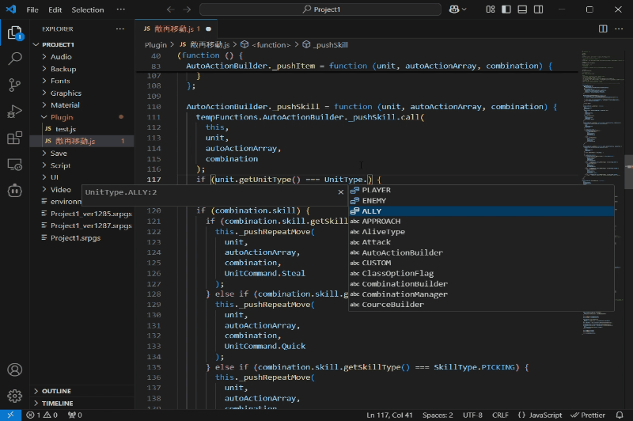
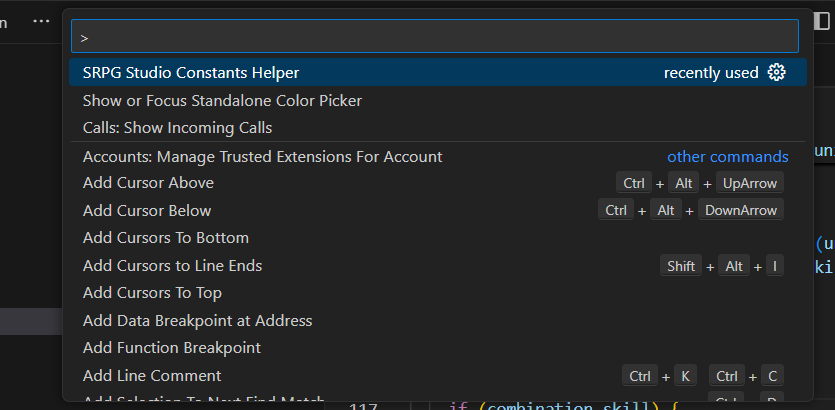
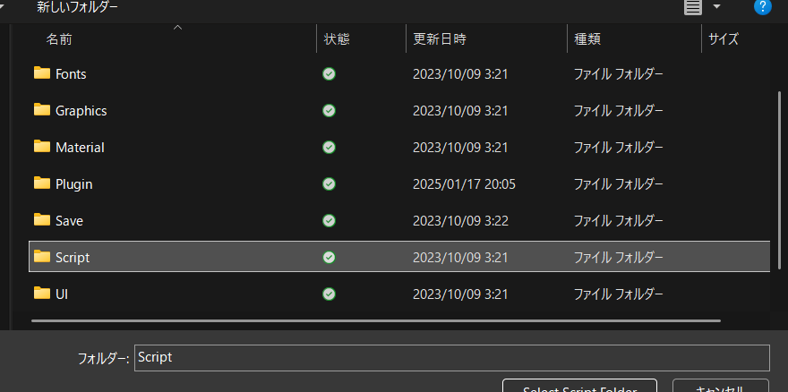
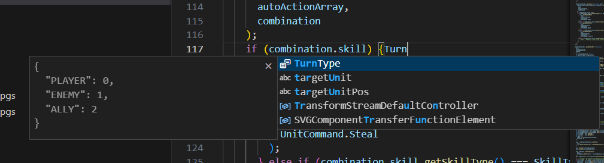

# VSCode Plugin SRPGStudioConstantsHelper

この拡張はSRPGStudioプラグイン向けのものです。  
Scriptフォルダ内にある`constants-enumeratedtype.js`で定義されている定数がサジェストされるようになります。  

## 設定方法
`Ctrl+Shift+P`後、`SRPGStudio Constants Helper`をコマンドを入力し、実行します。  

SRPGStudioのプロジェクトフォルダに付属されているScriptフォルダを選択します。   

これで、コード編集時に下記のようなサジェストが追加されるようになります。  

## リリースノート
#### 1.0.0
初版公開